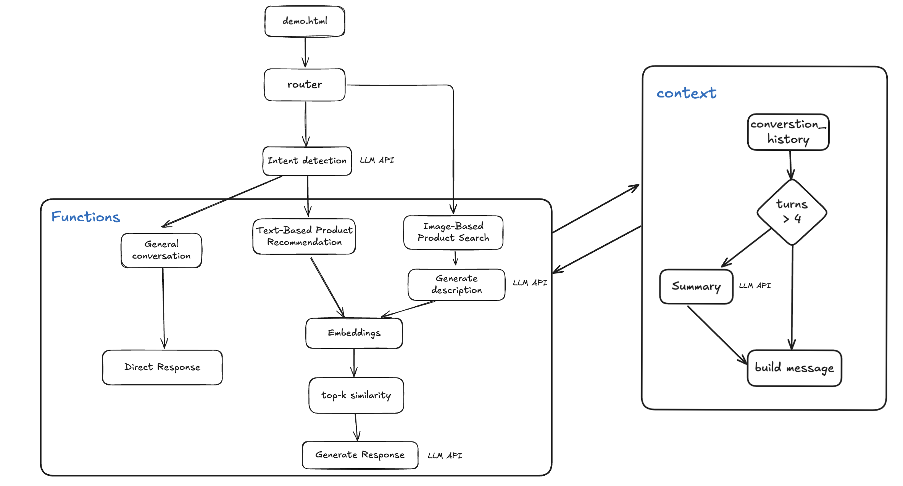

# Commerce Assistant (Rufus‑like)

An AI‑powered shopping assistant that supports natural conversation, text‑based product recommendations, and image‑based product search over a small predefined catalog. 

## Brief Introduction
In this project, I mainly implemented the following features:
1. General conversation with agent
2. Text-Based Product Recommendation
3. Image-Based Product Search

 - The agent operates on a two-step intent-driven workflow to ensure accurate tool utilization and response generation:
   - Step 1: Intent & Tool Decision – The model first identifies user intent, then determines whether a tool (e.g., recommendation engine, image analyzer) is required, and defines the necessary parameters for tool invocation.
   - Step 2: Response Synthesis – Tool output is fed back into the conversation context, enabling the model to generate coherent, context-aware final responses that integrate tool results.

- The recommendation system leverages vector similarity search with a FAISS index, following a logic designed for precision and clarity:
  - First, user text requests are converted into embeddings, which are then compared against precomputed embeddings of products in the catalog (stored in a FAISS index for fast retrieval).
  - A similarity threshold is applied: if the top similarity score falls below the threshold, the system notifies the user that no matching items were found; if above, it returns the most similar products.
  - For further optimization, a two-stage ranking pipeline (top-k coarse ranking → fine-grained re-ranking + filtering) can be integrated to improve recommendation relevance.

- The image search function adopts a textual intermediary approach (with room for iteration), prioritizing alignment between "visual input" and "product relevance":
  - Instead of using image embeddings directly (a choice driven by the concern that visually similar images may not correspond to functionally or categorically similar products—though this assumption remains open to validation), the system first calls an image-to-text model to generate a concise textual description of the item in the input image.
  - This textual description is then embedded and used to search the product catalog (via the same vector similarity logic as text-based recommendations) to find the most relevant matches.

- Across the project, I’ve optimized context management to save tokens and reduce model confusion. When a   conversation exceeds four turns, I summarize earlier exchanges to prevent the conversation history from becoming too long.


## Architecture & Technology Choices

- **Backend: `FastAPI`**
  - Typed request/response models via `Pydantic` for clarity and validation.
  - Simple router structure in `app/api/*` for clean endpoint grouping.
- **Runtime: `Uvicorn`**
  - High‑performance ASGI server with straightforward configuration.
  - Health check exposed at `GET /health` for platform probes.
- **Data Layer: `SQLAlchemy + SQLite`**
  - SQLite (`commerce.db`) as the demo catalog; easy to persist on a single disk.
  - `app/database/database.py` initializes tables and optionally seeds products from `data/products_seed.json`.
- **Vector Search: `FAISS` CPU**
  - Product embeddings built from name + description; normalized vectors for inner‑product similarity.
  - Index files stored under `data/faiss/` (`products.index` + `products_meta.json`).
- **Model Client: `openai` SDK**
  - Function‑calling (aka tool‑use) to route intents (text recommendation vs. image search).
  - Two‑stage completion: first decide tools, then synthesize a concise response.
- **Frontend: Minimal HTML (`demo.html`)**
  - Single file for quick UX validation without bundlers; uses relative API paths for same‑origin deploys.
- **Packaging & Deploy: `Docker`**
  - Reproducible builds; easy to run with `--env-file` and mounted volumes for persistence.
- **Logging**
  - Colored application logs; optional access logs via Uvicorn flags if desired.

## Architecture Diagram



Key flow:
- `demo.html` → `POST /api/chat` → Context Manager builds `messages[]`.
- LLM intent detection decides tool use and parameters (two-stage workflow).
- Text recommendation: embeddings + FAISS top‑k similarity.
- Image search: generate description (LLM) → embeddings + FAISS.
- Tool outputs are fed back for a second LLM synthesis to produce the final reply.

## Project Layout

- `app/main.py` – App factory, CORS, router registration, static/demo serving.
- `app/api/chat.py` – Chat endpoints and in‑memory conversation store.
- `app/api/products.py` – Product list/detail and image search endpoint.
- `app/api/admin.py` – Admin endpoint to reseed catalog and rebuild FAISS index.
- `app/services/*` – Agent, recommendations, and vector store ops.
- `app/models/*` – Pydantic models and SQLAlchemy entities.
- `data/` – Seed data and FAISS index files.
- `demo.html` – Minimal UI for conversation and image search.

## API Reference

Below are the primary endpoints and their contracts. All paths are relative to the server root.

### Demo Page
- `GET /demo.html`
  - Serves the minimal UI; uses relative paths to call backend endpoints.

### Chat
- `POST /api/chat`
  - Purpose: General conversation. The assistant may invoke tools for product recommendations based on the user request.
  - Request (JSON):
    - `message` (`string`) – user message.
    - `conversation_id` (`string`, optional) – continue an existing thread; generated if omitted.
    - `context` (`ConversationContext`, optional):
      - `user_preferences` (`object`, optional) – arbitrary hints/preferences.
      - `current_products` (`int[]`, optional) – IDs relevant to the current flow.
      - `session_data` (`object`, optional) – session‑level hints.
  - Response (JSON):
    - `message` (`string`) – assistant reply.
    - `conversation_id` (`string`) – ID for the thread.
    - `tool_calls` (`array`, optional) – tool invocations with `function`, `arguments`, and `result`.
    - `timestamp` (`string`) – ISO timestamp.
  - Example:
    ```bash
    curl -s http://localhost:8000/api/chat \
      -H 'Content-Type: application/json' \
      -d '{"message":"Recommend headphones under $300"}'
    ```

### Products
- `GET /api/products`
  - Returns the full product list (`ProductResponse[]`).
- `GET /api/products/{id}`
  - Returns one product by ID (`ProductResponse`).
- `POST /api/products`
  - Creates a product (demo purpose; not used by `demo.html`).

### Image Search
- `POST /api/products/image-search`
  - Purpose: Upload an image and let the assistant perform image‑based product search.
  - Request: `multipart/form-data` with `file=<image>`.
  - Response (JSON):
    - `message` (`string`) – concise English summary of matches.
    - `results` (`array<object>`) – top matches with product fields and similarity.
  - Example:
    ```bash
    curl -s -X POST http://localhost:8000/api/products/image-search \
      -F 'file=@/path/to/image.jpg'
    ```

### Admin
- `POST /api/admin/reseed-and-reindex`
  - Purpose: Reseed products from `data/products_seed.json` and rebuild the FAISS index.
  - Response: `{ "reseeded": <count>, "indexed": <count> }`.
  - Note: This endpoint is publicly reachable by default; in production you should protect it (see Security below).

### Conversation History
- `GET /api/conversations/{conversation_id}`
  - The public endpoint is intentionally disabled in production builds; the in‑memory store does not expose history.
  - Use server logs or future persistence (see Optimization) if you need auditability.

## Intent Routing & Context Management

### Intent Routing (Tool‑Use)
- Implemented in `app/services/agent.py` using function‑calling.
- Tools:
  - `recommend_products(...)` – embeddings + FAISS similarity over the catalog.
  - `search_by_image(...)` – generate a concise textual description via LLM, then embeddings + FAISS.
- Flow:
  1) Build a compact message history (see Context below).
  2) First completion: the model decides whether to call tools (`tool_choice: auto`) and parameters.
  3) Execute requested tools server‑side.
  4) Append a short system instruction to synthesize a concise, natural recommendation.
  5) Second completion: produce the final user‑facing message.
- Logs record whether tools were used and basic tool metadata for debugging.

### Context Management
- Conversation Memory: `app/api/chat.py` keeps an in‑memory `conversation_memory: Dict[str, List[ChatMessage]]` keyed by `conversation_id`.
  - Suitable for demos; not durable across restarts.
  - The demo UI maintains `conversationId` on the client and passes it to `/api/chat` to continue threads.
- Context Manager: `app/services/context.py` builds compact messages and controls summarization:
  - Summarize history when turns exceed `max_history_turns` (default 4) while keeping `keep_recent_turns` (default 2).
  - `build_messages()` injects the system prompt and attaches recent turns plus the current user message.
  - When tools were used and you choose LLM synthesis, `add_tool_synthesis_instruction()` appends a brief system nudge for concise English output.
- Optional Context: `ConversationContext` allows adding `user_preferences`, `current_products`, or arbitrary `session_data` to steer answers.

## Configuration

- Environment variables:
  - `OPENAI_API_KEY` – required for model calls.
  - `DATABASE_URL` – optional; defaults to SQLite file. Example: `sqlite:////app/commerce.db`.
  - `CORS_ORIGINS` – comma‑separated origins. Same‑origin `demo.html` requires no special CORS.
  - `SECRET_KEY` – placeholder for future auth features.
- Volumes (Docker/Render):
  - Mount/persist `commerce.db` and `data/` to keep catalog and FAISS index across deploys.


## Future Optimization 

Here are key improvements planned for the MVP demo:
1. Recommendation System: Enhance beyond basic embedding matching by adding multi-turn requirement clarification (proactively asking about missing attributes like budget, size). Implement personalized ranking with user profiles, using a two-stage process of coarse and fine-grained ranking.
2. Image Search: Replace text-intermediary approach with multimodal retrieval using product-specific image models for embedding, which better capture attributes like neckline and button styles.
3. Database Optimization: Move beyond SQLite to a multi-database architecture:
PostgreSQL with pgvector for product data and vectors
Redis for hot user behavior data (7-day window)
MySQL (sharded) for cold user preference data
4. Scalability & Monitoring: Add Nginx for rate limiting and message queues for asynchronous request handling. Address OpenAI's RPM/TPM limits by upgrading tiers as needed. Implement visual monitoring tools.

---
